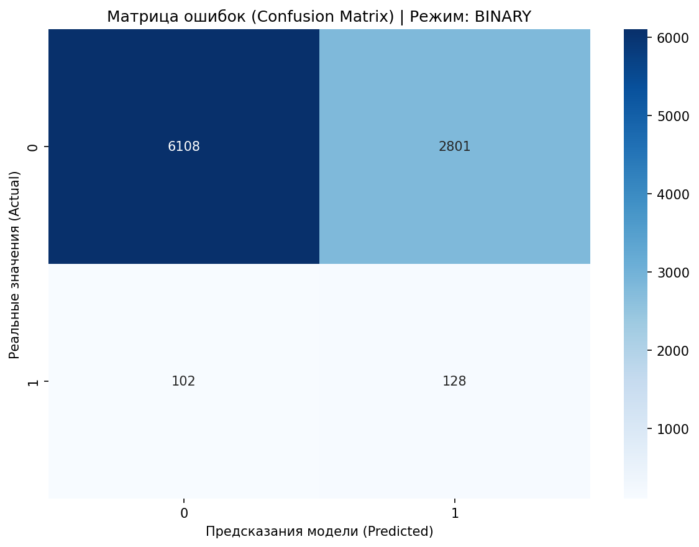
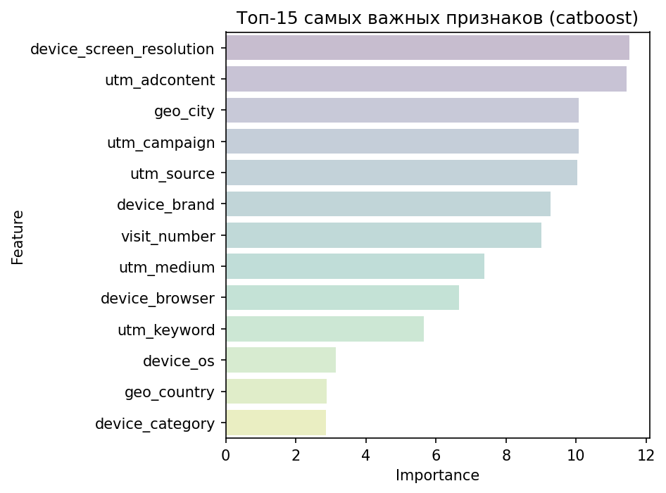
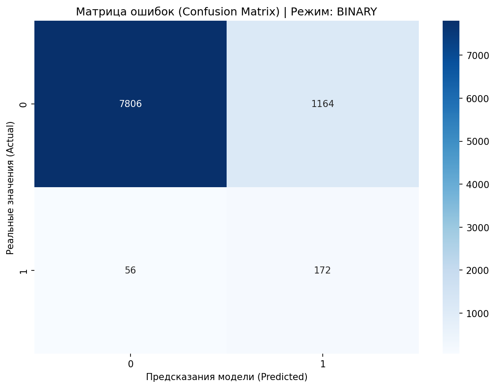
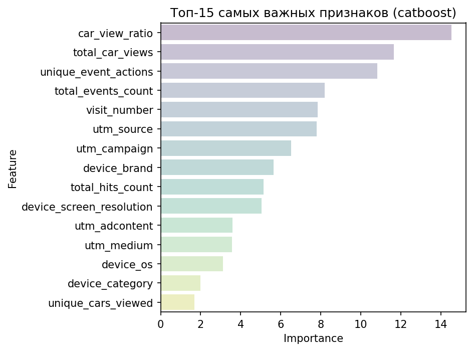

# sber_autopodpiska — предсказание целевого действия в сессии


Production-grade ML-пайплайн для бинарной классификации: предсказание вероятности совершения
целевого действия (заявка на автоподписку) в рамках пользовательской сессии на основе данных
веб-аналитики (Google Analytics-подобные хиты и сессии).

## Оглавление

- [Постановка задачи](#постановка-задачи)
- [Архитектура пайплайна](#архитектура-пайплайна)
- [Данные и препроцессинг](#данные-и-препроцессинг)
- [Путь от baseline к продакшн-модели](#путь-от-baseline-к-продакшн-модели)
- [Результаты](#результаты)
- [Установка и запуск](#установка-и-запуск)
- [Структура проекта](#структура-проекта)
- [Использование](#использование)
- [Тестирование](#тестирование)
- [Roadmap](#roadmap)

## Постановка задачи

**Бизнес-задача:** по данным сессии пользователя на сайте (источник трафика, устройство, гео,
поведенческие события) определить, будет ли совершено целевое действие — оставление заявки
на автоподписку на автомобиль.

**Таргет:** агрегируется на уровне сессии по правилу `>1 целевое событие → 1`.

**Целевая метрика:** ROC-AUC (выбрана из-за сильного дисбаланса классов и необходимости
ранжировать сессии по вероятности конверсии, а не просто классифицировать).

**Дисбаланс классов:** ~97% негативный класс / ~3% целевой класс.

**Модель:** CatBoost — выбор обусловлен тем, что ~90% признаков в датасете категориальные
(источники трафика, устройства, гео), и CatBoost нативно обрабатывает их без ручного
энкодинга. В `src/core/models/` также есть обёртки для LightGBM, XGBoost и PyTorch с единым
интерфейсом (`base.py`), но в текущей продакшн-конфигурации (`pyproject.toml`, extras `train`)
активна только CatBoost-ветка.

## Архитектура пайплайна

```
                     ┌──────────────┐
   raw hits/sessions │  PostgreSQL  │
   ──────────────────▶   (сырые     │
                     │   данные)    │
                     └──────┬───────┘
                            │ SQL-витрина (sql/features/*.sql)
                            ▼
                 ┌────────────────────┐
                 │ SqlAggregatedData   │  ← агрегация по сессии,
                 │ Source (train)      │    без утечки будущего
                 └──────────┬──────────┘
                            ▼
                 ┌────────────────────┐
                 │  Preprocessing +    │  src/core/features.py
                 │  Feature Engineering│
                 └──────────┬──────────┘
                            ▼
                 ┌────────────────────┐
                 │   MLPipeline        │  src/core/pipeline.py
                 │  (train / tune /    │  Hydra-конфиги (configs/)
                 │   evaluate)         │  MLflow tracking + Optuna
                 └──────────┬──────────┘
                            ▼
              ┌─────────────┴─────────────┐
              ▼                           ▼
     ┌─────────────────┐         ┌─────────────────┐
     │ Airflow DAGs     │         │ FastAPI service  │
     │ (DockerOperator) │         │ /predict /health │
     │ retrain_pipeline │         │ /metrics          │
     │ deploy_model     │         │ (Prometheus)      │
     │ batch_inference  │         └─────────────────┘
     └─────────────────┘
```

Оркестрация обучения/инференса — единая точка входа `main.py` с режимами
`train / tune / evaluate / inference`, управляемыми через Hydra-конфиги (`configs/`).
Все шаги (даталоадинг, препроцессинг, обучение, инференс) упакованы в переиспользуемые
Docker-образы (`api`, `train`, `airflow`, `mlflow`), которые Airflow запускает через
`DockerOperator`, а не через прямой вызов Python-кода внутри самого Airflow-контейнера —
это даёт изоляцию зависимостей train/serving слоёв.

## Данные и препроцессинг

**Устранение утечки данных (data leakage):** в первой версии агрегации в фичи попадали
переменные, косвенно содержащие информацию о будущем внутри сессии (например,
`hits_before_target`, счётчики событий, посчитанные с учётом самого целевого действия).
После рефакторинга SQL-витрины (`sql/features/engineered_aggregation.sql`) поведенческие
счётчики (`total_hits_count`, `total_events_count`, `unique_event_actions`) считаются строго
без учёта таргет-события, оконные функции, заглядывающие в конец сессии, исключены.

**Препроцессинг (`src/core/features.py`):**
- пропуски в числовых признаках — медиана;
- пропуски в категориальных признаках — мода;
- выбросы — метод IQR с порогом 1.5;
- удаление признаков с >90% пропусков;
- удаление квазиконстантных признаков (>99% значений в одной категории);
- удаление строк с >50% пропущенных значений.

**Feature engineering:** помимо базового поведенческого контекста сессии (utm-метки,
устройство, гео, счётчики просмотров) был протестирован дополнительный блок признаков —
геометрия экрана, макро-гео-зоны, календарные и временные флаги, внешняя демографическая
статистика по городам. Эксперимент **не дал прироста по ROC-AUC** (см. раздел
[Результаты](#результаты)) — почти весь блок осел в низу распределения feature importance,
поэтому в продакшн-версии признакового пространства этот блок не используется целиком:
единственный сохранённый элемент — `screen_area`, показавший стабильную, пусть и небольшую,
значимость.

## Путь от baseline к продакшн-модели

| Этап | Что изменилось | ROC-AUC |
|---|---|---|
| **Dirty baseline** | Признаки с утечкой данных, `class_weights=Balanced` | **0.67** |
| **Устранение утечки** | Переписана SQL-агрегация: поведенческие счётчики считаются без учёта таргета | **0.87** |
| **Feature engineering эксперимент** | Добавлен блок технических/демографических признаков — эффекта не дал, из продакшн-версии исключён | 0.8694 (не принят) |
| **Тюнинг (Optuna, 50 trials, TPE)** | Подбор `depth`, `learning_rate`, `l2_leaf_reg`, `random_strength`, `scale_pos_weight` | **0.879** |

### Dirty baseline: диагностика

На грязном baseline с `class_weights=Balanced` дисбаланс классов не был устранён по сути:
модель систематически присваивала высокую вероятность (0.82–0.84) объектам класса 0, то есть
была «фатально уверена» в конверсии там, где её не было. Ошибки в обе стороны (FP/FN)
распределены пропорционально, топ-важные признаки — `device_screen_resolution`, `utm_adcontent`, `utm_campaign`,
`device_brand`, `utm_source`.




### После устранения утечки

Честный ROC-AUC вырос с 0.67 до 0.87. Матрица ошибок показывает, что модель уверенно находит
негативный класс, но заметно перестраховывается на позитивных предсказаниях (склонность к
False Positive на активных, но не сконвертировавшихся пользователях). Ошибки распределены
равномерно по времени суток и utm-каналам — аномальных провалов по конкретным сегментам
трафика не обнаружено, что говорит о стабильности признакового пространства.



### Финальная модель (после тюнинга)

Пространство поиска Optuna (TPESampler, 50 trials):

| Параметр | Диапазон |
|---|---|
| `depth` | [4, 8] |
| `learning_rate` | [0.01, 0.15] |
| `l2_leaf_reg` | [1.0, 10.0] |
| `random_strength` | [0.001, 2.0] (log scale) |
| `scale_pos_weight` | [40.0, 100.0] |

**Лучшие параметры:** `depth=7`, `learning_rate≈0.0218`, `l2_leaf_reg≈3.11`,
`random_strength≈0.0035`, `scale_pos_weight≈47.63`.




## Результаты

Метрики финальной модели на валидации:

| Метрика | Значение |
|---|---|
| ROC-AUC | **0.879** |
| Accuracy | 0.8344 |
| F1 (weighted) | 0.8890 |

Наибольший вклад в предсказание вносят поведенческие признаки внутри сессии —
`car_view_ratio`, `total_car_views` и `unique_event_actions` уверенно лидируют по важности,
обгоняя даже контекст рекламного трафика. Это говорит о том, что глубина вовлечённости
пользователя (сколько машин он посмотрел, насколько активно взаимодействовал с карточками)
— более сильный сигнал конверсии, чем то, откуда он пришёл. Признаки канала привлечения
(`utm_source`, `utm_campaign`, `utm_medium`) и `device_brand` также входят в топ, но занимают
вторичные позиции — они скорее уточняют профиль пользователя, чем определяют исход сессии.

## Установка и запуск

### Требования

- Docker Desktop
- Python 3.10 (для локального запуска без Docker)
- `.env` файл на основе `.env.example` (переменные PostgreSQL, MLflow, API-ключи)

### Через Docker Compose

```bash
cd configs/deploy
docker compose up -d          # postgres, mlflow, api, airflow-webserver/scheduler
docker compose --profile build-only build train   # собрать train-образ отдельно
```

Сервисы после запуска:

| Сервис | Порт | Назначение |
|---|---|---|
| `api` | 8000 | FastAPI-инференс (`/predict`, `/health`, `/metrics`) |
| `mlflow` | 5000 | MLflow Tracking UI |
| `airflow-webserver` | 8080 | Airflow UI (DAGs: `retrain_pipeline`, `deploy_model`, `batch_inference`) |
| `postgres` | 5432 | Хранилище сырых данных + backend MLflow |

### Локально (без Docker)

```bash
make venv && source .venv/bin/activate   # Windows: .venv\Scripts\activate
make install
make run-train        # mode=train
make run-tune          # mode=tune (Optuna + финальное обучение с лучшими параметрами)
make run-evaluate      # mode=evaluate
make run-inference     # mode=inference
```

## Структура проекта

```
├── configs/              # Hydra-конфиги (data, model, training, paths, deploy, security)
├── dags/                 # Airflow DAG'и (DockerOperator): retrain, deploy, batch inference
├── docker/                # Dockerfile'ы: api, train, airflow, mlflow
├── notebooks/             # EDA, feature engineering, baseline, error analysis, SHAP, demo
├── reports/                # Артефакты по версиям (confusion matrix, feature importance)
├── sql/                   # SQL-витрины агрегации и EDA-запросы
├── src/
│   ├── api/                # FastAPI-сервис инференса (main.py, schemas.py, dependencies.py)
│   ├── core/                # Ядро пайплайна
│   │   ├── data.py            # DataSource-иерархия (Sql/FlatFile)
│   │   ├── features.py        # Препроцессинг и feature engineering
│   │   ├── splitting.py       # Group-level split (защита от утечки между train/val)
│   │   ├── pipeline.py        # MLPipeline: train/evaluate/predict/save/load
│   │   ├── tuner.py           # OptunaTuner
│   │   ├── artifacts.py       # ArtifactManager (обёртка над MLflow)
│   │   ├── models/             # Обёртки моделей: catboost, lightgbm, xgboost, pytorch
│   │   └── visualisation.py   # Графики error analysis / feature importance для MLflow
│   └── eda/                 # EDA-модуль
├── tests/
│   ├── unit/                # Быстрые изолированные тесты (data, features)
│   └── integration/         # pipeline, reproducibility, latency, artifacts, model behavior
├── main.py                  # Точка входа: mode=train|tune|evaluate|inference
└── Makefile
```

## Использование

Обучение и инференс идут через единый orchestrator с переопределением Hydra-конфига:

```bash
python -m main mode=train model=catboost
python -m main mode=tune                       # Optuna + автообучение финальной модели
python -m main mode=evaluate model.model_version=0.1.1
python -m main mode=inference
```

Пример запроса к serving API:

```bash
curl -X POST http://localhost:8000/predict \
  -H "Content-Type: application/json" \
  -H "X-API-Key: key-one" \
  -d '{"utm_source": "...", "utm_campaign": "...", "device_brand": "...", ...}'
```

Схема входных данных для `/predict` строится динамически из
`models/feature_schema_v{X}.json`, поэтому список полей всегда синхронизирован с версией
признаков, на которой обучалась текущая продакшн-модель.

## Тестирование

```bash
make test              # все тесты
make test-unit         # unit: data.py, features.py
make test-integration   # integration: pipeline, reproducibility, latency (P95), artifacts
```

Интеграционные тесты отдельно проверяют детерминизм обучения (одинаковый seed → идентичные
предсказания), стабильность инференса и P95-латентность serving-слоя.

## Roadmap

- [ ] Удаление неэффективного блока признаков (`geo_zone`, городская демография) из
      признакового пространства для ускорения инференса
- [ ] Активация LightGBM/XGBoost веток как альтернативных моделей для A/B-сравнения с CatBoost
- [ ] Вынос `sqlalchemy`-импорта в `data.py` под ленивую загрузку, чтобы облегчить `api`-образ
